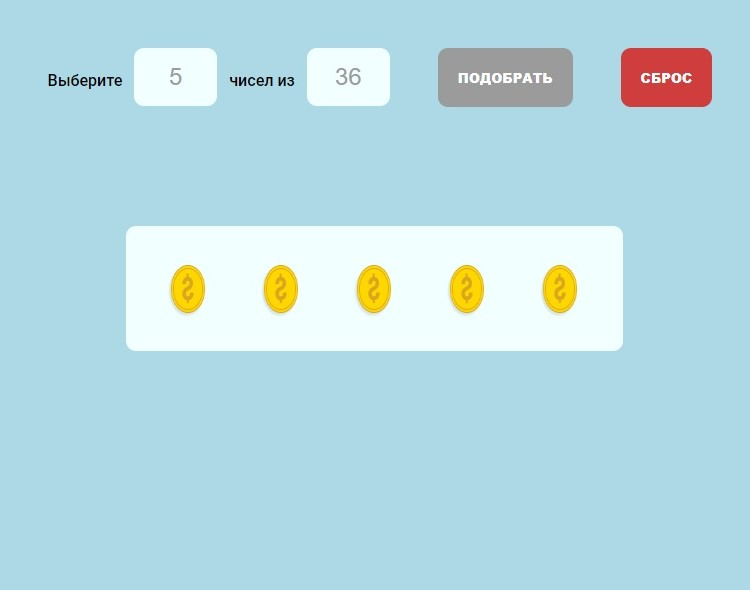

# RANDOMLOTTO

This test project was bootstrapped with [Create React App](https://github.com/facebook/create-react-app).

## Available Scripts

In the project directory, you can run:

### `npm start`

Runs the app in the development mode.\
Open [http://localhost:3000](http://localhost:3000) to view it in your browser.

## `How to use:`

- define the amount of required numbers
- define  the range of numbers (limit)
- push the button to get the numbers
- push one more time to get another set
